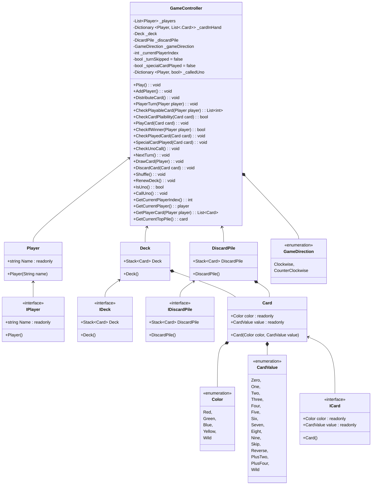

```mermaid
classDiagram
%%Interfaces
    class ICard {
        <<interface>>
        +Color color : readonly
        +CardValue value : readonly
        +Card()
    }

    class IPlayer{
        <<interface>>
        +string Name : readonly 
        +Player()

    }

    class IDeck{
        <<interface>>
        +Stack~Card~ Deck  
        +Deck()
    }

    class IDiscardPile{
        <<interface>>
        +Stack~Card~ DiscardPile
        +DiscardPile()
    }

     %%Classes
    
    class Card {
        +Color color : readonly
        +CardValue value : readonly
        +Card(Color color, CardValue value)
    }

   
    class Player{
        +string Name : readonly 
        +Player(String name)

    }

    class Deck{
        +Stack~Card~ Deck  
        +Deck()
    }

    class DiscardPile{
        +Stack~Card~ DiscardPile
        +DiscardPile()
    }

    class GameController{
        -List~Player~  _players
        -Dictionary ~Player, List<.Card>~  _cardInHand  
        -Deck _deck 
        -DicardPile _discardPile
        -GameDirection _gameDirection 
        -int _currentPlayerIndex 
        -bool _turnSkipped = false 
        -bool _specialCardPlayed = false
        -Dictionary ~Player, bool~  _calledUno 

        +Play() : void
        +AddPlayer() : void
        +DistributeCard() : void
        +PlayerTurn(Player player) : void

        +CheckPlayableCard(Player player) : List~int~
        +CheckCardPlaibility(Card card) : bool
        +PlayCard(Card card) : void
        +CheckIfWinner(Player player) : bool
        +CheckPlayedCard(Card card) : void
        +SpecialCardPlayed(Card card) : void

        +CheckUnoCall() : void
        +NextTurn() : void

        +DrawCard(Player) : void
        +DiscardCard(Card card) : void
        +Shuffle() : void
        +RenewDeck() : void

        +IsUno() : bool
        +CallUno() : void

        +GetCurrentPlayerIndex() : int
        +GetCurrentPlayer() : player
        +GetPlayerCard(Player player) : List~Card~
        +GetCurrentTopPile() : card
     }

    class Color{
        <<enumeration>>
        Red,
        Green,
        Blue,
        Yellow,
        Wild
    }
    
    class CardValue{
        <<enumeration>>
        Zero,
        One,
        Two,
        Three,
        Four,
        Five,
        Six,
        Seven,
        Eight,
        Nine,
        Skip,
        Reverse,
        PlusTwo,
        PlusFour,
        Wild
    }

    class GameDirection{
        <<enumeration>>
        Clockwise,
        CounterClockwise
    }

    Deck *-- Card
    DiscardPile *-- Card 

    Card *-- Color
    Card *-- CardValue
    
    GameController <-- Player
    GameController <-- Deck
    GameController <-- DiscardPile
    GameController *-- GameDirection

    Card <-- ICard
    Player <-- IPlayer
    Deck <-- IDeck
    DiscardPile <-- IDiscardPile
```
