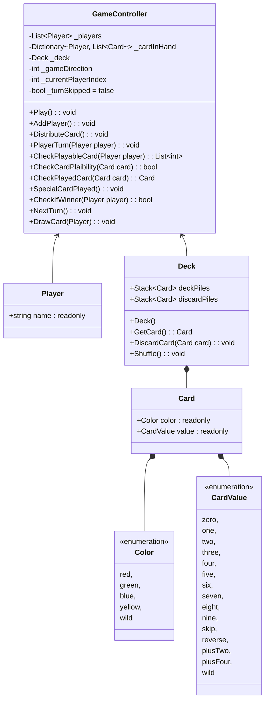

```mermaid
classDiagram
    class Card {
        +Color color : readonly
        +CardValue value : readonly
    }

    class Player{
        +string name : readonly 
    }

    class Deck{
        +Stack~Card~ deckPiles 
        +Stack~Card~ discardPiles 
        
        +Deck()
        +GetCard() : Card
        +DiscardCard(Card card) : void
        +Shuffle() : void
    }

    class GameController{
        -List~Player~  _players
        -Dictionary~Player, List~Card~~ _cardInHand  
        -Deck _deck 
        -int _gameDirection 
        -int _currentPlayerIndex 
        -bool _turnSkipped = false 

        +Play() : void
        +AddPlayer() : void
        +DistributeCard() : void
        +PlayerTurn(Player player) : void
        +CheckPlayableCard(Player player) : List~int~
        +CheckCardPlaibility(Card card) : bool
        +CheckPlayedCard(Card card) : Card
        +SpecialCardPlayed() : void
        +CheckIfWinner(Player player) : bool
        +NextTurn() : void

        +DrawCard(Player) : void
     }

    class Color{
        <<enumeration>>
        red,
        green,
        blue,
        yellow,
        wild
    }
    
    class CardValue{
        <<enumeration>>
        zero,
        one,
        two,
        three,
        four,
        five,
        six,
        seven,
        eight,
        nine,
        skip,
        reverse,
        plusTwo,
        plusFour,
        wild
    }

    Deck *-- Card 

    Card *-- Color
    Card *-- CardValue
    
    GameController <-- Player
    GameController <-- Deck
```
